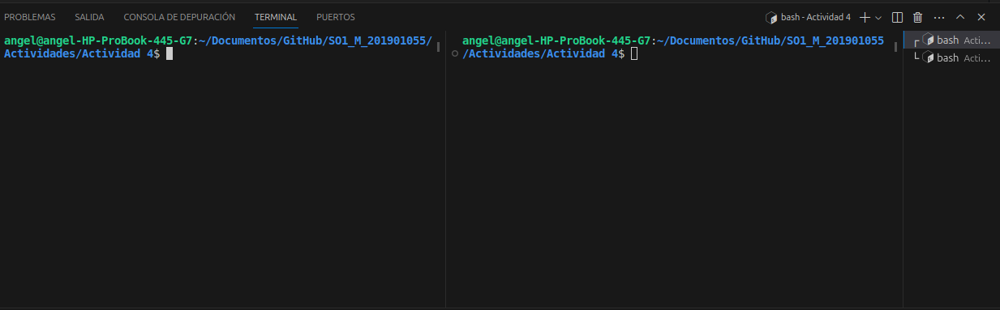

___
# Actividad 4
___
***Descripcion***
Crear un systemd unit de tipo servicio que realice lo siguiente.
Ejecutar un script imprima un saludo y la fecha actual infinitamente con una pausa de un segundo.
Habilitar el servicio para que se inicie con el sistema 

## ARCHIVOS BASH
___
***Pasos para usarlo***
Para la part1.sh
Se crear dos fifo para la comunicacion interprocesos
```bash
    mkfifo /tmp/user1_to_user2
    mkfifo /tmp/user2_to_user1
```

Se crea un bucle que ejecuta un chat entre dos usuarios utilizando fifo nombradas. 
```bash
     read -p "User1: " msg
  if [[ "$msg" == "exit" ]]; then
    echo "Chat finalizado"
    break
  fi
  echo "$msg" > /tmp/user1_to_user2
  if read -t 1 response < /tmp/user2_to_user1; then
    echo "User2: $response"
  fi
done
```

Se eliminar las dos fifo
```bash
    rm /tmp/user1_to_user2
    rm /tmp/user2_to_user1
```

Para la part2.sh
```bash
#!/bin/bash
while true; do
  if read -t 1 msg < /tmp/user1_to_user2; then
    echo "User1: $msg"
    read -p "User2: " response
    if [[ "$response" == "exit" ]]; then
      echo "Chat finalizado"
      break
    fi
    echo "$response" > /tmp/user2_to_user1
  fi
done
```

## CHAT
___
***Pasos para usarlo***
1.Abrir dos terminales 
2.En una terminal ejecutar 'part1.sh' y en la otra ejecutar 'part2.sh'
3.Ya se pueden enviar mensajes de un chat a otro

***Abir las terminales***


***Demostracion de uso***

